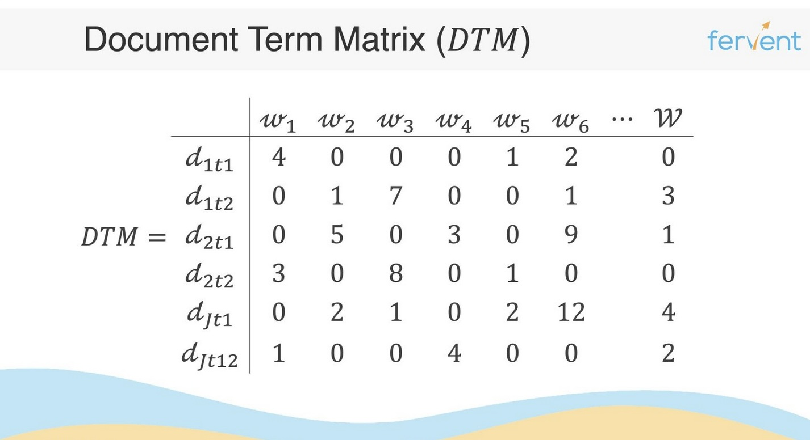
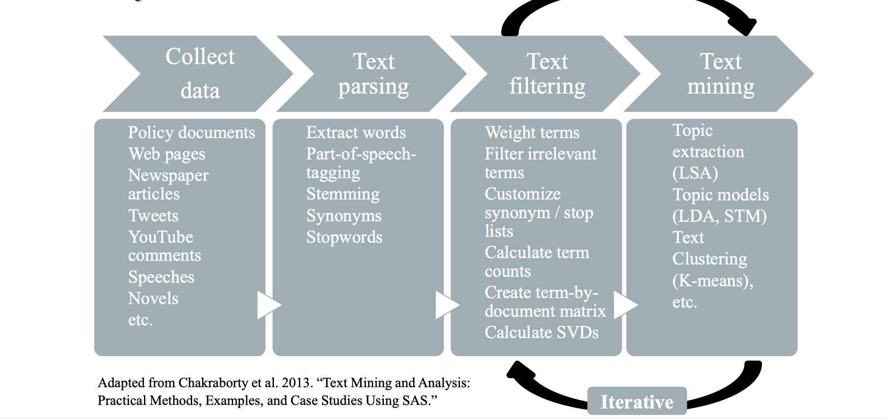

::: {.callout-note}
Code chunks on this page are shown for reference (`eval: false`). Run them yourself
in RStudio.
:::

## What is Natural Language Processing (NLP)?

Natural Language Processing (NLP) is an interdisciplinary field between
computer science and linguistics, which ultimately aims to
quantitatively represent text in such a form that computers can
understand it. The methods developed within NLP are used in a variety
of different fields and applications, such as sociology, political
science, and various private companies. Due to the growing availability
of digital trace data, NLP has become a transformative subfield that
affects most people's daily lives through the latest advances in
machine learning.

## Let's talk a bit about Wikipedia

Wikipedia is a free online encyclopedia, created and edited by
volunteers around the world and hosted by the Wikimedia Foundation
since 2001. It is one of the largest and most popular general reference
works on the internet, with millions of articles in multiple languages.
Wikipedia is written collaboratively by largely anonymous volunteers
who write without pay. Anyone with internet access can write and make
changes to Wikipedia articles, except in limited cases where editing is
restricted to prevent disruption or vandalism.

Wikipedia is a reflection of our contemporary knowledge production —
it crucially shapes what people know and how they remember the past. Wikipedia is influencing media content, scientific research, foundational for generative AI, and ordinary citizens' real-life decisions. Journalistic work has additionally shown that political groups proactively seek to edit Wikipedia in their favor, such as politicians
\href{https://journals.sagepub.com/doi/full/10.1177/0894439317703579?casa_token=BHj2Jplj2owAAAAA\%3AlR1T_Lpdxs9V3BM4XUVZbxLXY8IbsSp1mxRP4U9YdzwWqlF-50rtFFVP-CgUjM54bPtmiw6N6ce2}{Paper} or far-right actors (\href{https://www.ardaudiothek.de/sendung/sockenpuppenzoo-angriff-auf-wikipedia/urn:ard:show:d223c352027c8c67/}{Sockenpuppenzoo}. Previous research has shown that number editors on Wikipedia are limited and predominantly male, reflecting persisting patterns of gender inequality in other aspects of society.

## Web Scraping

The current advances in machine learning, combined with the growing
amount of digital data, have led to a new interest in NLP. Web scraping
is the process where we "scrape" data from the web, which is then used
to train a model. Compared to traditional data collection methods, web
scraping allows us to gather far more data in a much shorter time.

We can either scrape data from a website (static) or from an
Application Programming Interface (dynamic). The latter is often more
efficient, as it allows us to access data directly from the source
without having to parse HTML. [rvest](https://rvest.tidyverse.org/) is
a package that helps you scrape data from web pages statically. We're
scraping the award table on
[this Wikipedia page](https://en.wikipedia.org/wiki/List_of_Nobel_laureates).

```{r}
#| label: static-scraping
# Install and import packages
# install.package("pacman")
library(pacman)
pacman::p_load("rvest", "tidyverse")

# Define the URL of the page we want to scrape
url <- read_html("https://en.wikipedia.org/wiki/List_of_Nobel_laureates")

# Extract the table from the page
nobel_table <- url %>%
  html_node("table") %>%   # selects the first table on the page
  html_table()              # converts the HTML table to a data frame
```

### API

Scraping data through the Wikipedia web API is relatively easy. An API
is a piece of software that allows two pieces of software to talk to
each other, in most cases through an HTTP request — similar to the
request your browser sends when it asks a server for a page's HTML.

The process is roughly always the same:

1. You connect to the URL of your API, e.g. `en.wikipedia.org/w/api.php`
2. You send an HTTP GET request to the API with specific parameters —
   this tells the API what you want.
3. You retrieve a response, usually in JSON.

```{r}
#| label: dynamic-scraping
library(httr2)

get_last_revision <- function(page_title, continue_parameter = NULL,
                               user_agent = "Polmem_ucl") {
  baseurl <- "https://en.wikipedia.org/w/api.php"

  params <- list(
    action  = "query",
    format  = "json",
    titles  = as.character(page_title),
    prop    = "revisions",
    rvprop  = "ids|timestamp|user|userid|comment|size|content",
    rvslots = "main",
    rvlimit = 1,       # just the latest
    rvdir   = "older"  # newest first; single item is current revision
  )

  if (!is.null(continue_parameter)) params$rvcontinue <- continue_parameter

  resp <- request(baseurl) %>%
    req_user_agent(user_agent) %>%
    req_url_query(!!!params) %>%
    req_perform()

  json <- resp_body_json(resp)

  pages <- json$query$pages
  if (is.null(pages) || !length(pages)) return(data.frame())

  pg <- pages[[1]]
  if (is.null(pg$revisions) || !length(pg$revisions)) return(data.frame())

  rv <- pg$revisions[[1]]
  slots <- rv$slots$main

  data.frame(
    page_title    = pg$title %||% NA_character_,
    page_id       = as.character(pg$pageid %||% NA),
    revid         = as.character(rv$revid %||% NA),
    parentid      = as.character(rv$parentid %||% NA),
    user          = as.character(rv$user %||% NA_character_),
    userid        = as.character(rv$userid %||% NA),
    timestamp     = as.character(rv$timestamp %||% NA_character_),
    size          = as.character(rv$size %||% NA),
    comment       = as.character(rv$comment %||% NA_character_),
    contentmodel  = slots$contentmodel %||% NA_character_,
    contentformat = slots$contentformat %||% NA_character_,
    content       = slots[["*"]] %||% NA_character_,
    check.names = FALSE,
    stringsAsFactors = FALSE
  )
}

# Applying the function
page_content_revision <- get_last_revision("List of Nobel laureates")
```

### Using Wrappers

For most relatively accessible APIs, someone has built a wrapper. There
exist two main wrappers for Wikipedia in R: `WikipediR` and
`wikkitidy`. We use the
[WikipediR package](https://cran.r-project.org/web/packages/WikipediR/WikipediR.pdf),
which lets us send requests to the Wikipedia API in just a few lines of
code. We only need to specify the language, the project, and the page
name. Unfortunately, `WikipediR` does not parse the HTML for us, so we
use the `XML` package to parse it and extract the table.

```{r}
#| label: wikipedir-wrapper
library(WikipediR)
library(XML)

# WikipediR wrapper
page_content_nobel <- WikipediR::page_content(
  language = "en", project = "wikipedia",
  page_name = "List of Nobel laureates", clean_response = TRUE
)

# Parsing the html
parsed_html <- htmlParse(page_content_nobel, asText = TRUE)
first_table <- readHTMLTable(parsed_html, which = 1, stringsAsFactors = FALSE)
colnames(first_table) <- first_table[1, ]
first_table <- first_table[-1, ]
```

### Task

- Scrape the biographies of the female and male Nobel laureates from
  Wikipedia. You can do this dynamically or statically — if
  dynamically, use the `WikipediR` or `wikkitidy` package.
- Wikipedia helps us here via its category structure: scrape all pages
  and their content under [Category: Lists of Nobel laureates](https://en.wikipedia.org/wiki/List_of_female_Nobel_laureates).

One approach: use `pages_in_category()` from `WikipediR` to retrieve
all pages within the "Women Nobel laureates" category. There isn't a
similar category for men, so pivot the `nobel_table` scraped earlier,
filter out the names, and merge.

```{r}
#| label: task-female-winners
# Retrieving all pages in the category (but not content yet)
all_pages_category_women <- WikipediR::pages_in_category(
  "en", "wikipedia", categories = "Women Nobel laureates",
  clean_response = TRUE
)
all_pages_category_women <- all_pages_category_women[-c(1, 2), ]

nobel_table <- nobel_table %>%
  slice(-n()) %>%
  pivot_longer(-Year, names_to = "category", values_to = "laureates") %>%
  rename(title = laureates)

women <- left_join(all_pages_category_women, nobel_table, by = "title") %>%
  select(title, category, Year) %>%
  mutate(gender = "female")

men <- nobel_table %>%
  filter(!title %in% women$title) %>%
  mutate(gender = "male")

all_winners <- bind_rows(women, men)
```

```{r}
#| label: task I - solutions
#| code-fold: true
#| code-summary: "Show solution"


# preprocess the scraped data to get a clean list of names
names_tbl <- all_winners %>%
  filter(!is.na(title), nzchar(title), tolower(str_trim(title)) != "none") %>% # delete all empty cells
  # drop “no award” rows that are just dashes (any kind)
  filter(!str_detect(title, "^[[:space:]]*[—–-]+[[:space:]]*$")) %>%
  # some cells have multiple winners separated by semicolons
  separate_rows(title, sep = "\\s*;\\s*") %>%
  # strip bracketed citation markers like [a], [13]
  mutate(title = str_remove_all(title, "\\[(?:\\d+|[A-Za-z])\\]")) %>%
  mutate(title = str_squish(title)) %>%
  filter(!title %in% c("None", "List of women Nobel laureates", "Cancelled due to World War II")) %>%
  filter(nzchar(title))

# unique vector of names
all_names <- names_tbl %>%
  distinct(title) %>%
  arrange(title) %>%
  pull(title)

summaries_pages <- data.frame()

for (title in all_names) {
  
  summary_page <- tryCatch(wikkitidy::get_page_summary(language = "en", title = title),
    error = function(e) NULL)
  
  if (!is.null(summary_page)) {
    summaries_pages <- bind_rows(summaries_pages, summary_page)
  }
}
```


## Data Preparation

A pre-scraped data set is provided, containing all summaries of the
biographies of all award winners, with columns:

- `pageid` — unique identifier for each Wikipedia page
- `title` — the Wikipedia page title (the laureate's name)
- `extract` — the summary of the biography
- `revision` — unique identifier for the specific page revision
- `gender` — whether the awarded individual was female or male

[⬇ Download `wikipedia_nobel_biographies_summaries_clean.qs` (134 KB)](../data/wikipedia_nobel_biographies_summaries_clean.qs){.btn .btn-outline-primary role="button" download="wikipedia_nobel_biographies_summaries_clean.qs"}

```{r}
#| label: inspect-clean-data
library(qs)

clean_text_data <- qread("../data/wikipedia_nobel_biographies_summaries_clean.qs")
glimpse(clean_text_data)

clean_text_data <- clean_text_data %>%
  drop_na(title)

# Gender distribution
proptable <- prop.table(table(clean_text_data$gender))
round(proptable, digits = 2)
```
Looking at the gender distribution reveals how imbalanced Nobel prizes
are with respect to gender — only about 4.6% of all prizes were
awarded to women. Let's find out how these women are depicted on
Wikipedia.

### Optional Task

[⬇ Download `wikipedia_nobel_biographies_summaries_extended_clean.qs` (136 KB)](../data/wikipedia_nobel_biographies_summaries_extended_clean.qs){.btn .btn-outline-primary role="button" download="wikipedia_nobel_biographies_summaries_extended_clean.qs"}

- Read the `wikipedia_nobel_biographies_summaries_extended_clean.qs`
  data set and store it in a new object.
- Drop NA values in the `title` variable.
- Select a subset of columns, but keep the gender column.
- Filter out only female instances.

```{r}
#| label: task-extended-clean-data
#| code-fold: true
#| code-summary: "Show solution"

wiki_summaries_ex <- qread("../data/wikipedia_nobel_biographies_summaries_extended_clean.qs")

wiki_summaries_ex <- wiki_summaries_ex %>%
  drop_na(title) %>%
  select(pageid, title, extract, revision, gender) %>%
  filter(gender == "female")

```


## Text Preprocessing

Text preprocessing transforms raw text data into a clean, structured
format suitable for analysis. Scraping your own data is often
painful — the goal of preprocessing is to enhance the quality of the
text by removing noise, inconsistencies, and irrelevant information.

We first create a **corpus** — our set of documents with their
corresponding text (e.g. different Wikipedia articles). A corpus
consists of documents, which consist of sentences, which consist of
terms.

Common preprocessing techniques:

- **Tokenization** — breaking text into smaller units (words, phrases,
  or sentences).
- **Lowercasing** — ensures uniformity and reduces complexity.
- **Removing punctuation and special characters** — these usually
  don't contribute to meaning.
- **Removing stop words** — common words ("and", "the", "is") that
  don't carry much meaning.
- **Stemming and lemmatization** — reduce words to their base/root
  form.

We use the [quanteda](https://quanteda.io/) package for text preprocessing.

```{r}
#| label: text-preprocessing
library(quanteda)

# Create corpus
corpus <- corpus(clean_text_data, text_field = "extract", docnames = "pageid")

# Tokenization
tokens <- corpus %>%
  tokens(remove_punct = TRUE,
         remove_symbols = TRUE) %>%
  tokens_remove(stopwords("en"), padding = FALSE) %>%
  tokens_tolower() %>%
  tokens_compound(pattern = clean_text_data$title, concatenator = "_", case_insensitive = FALSE) %>%
  tokens_compound(pattern = "nobel prize", concatenator = "_", case_insensitive = FALSE) %>%
  tokens_wordstem()
```

## The Document-Feature Matrix (DFM)

A Document-Feature Matrix (DFM), or Document-Term-Matrix (DTM), is a
structured representation of text data that captures the frequency or
presence of words (features) across a collection of documents. Rows
represent documents, columns represent unique terms, and each cell
holds the frequency of a term in a document. With many words and few
documents the matrix gets very sparse — watch out for the
[Curse of Dimensionality](https://www.geeksforgeeks.org/machine-learning/curse-of-dimensionality-in-machine-learning/)!

A DFM is a crucial step in NLP: it transforms unstructured text into a
structured format that statistical and machine learning techniques can
work with. It holds a few key assumptions ("bag of words"):

- The words in a document convey meaning.
- Word order does not matter.
- Word combinations do not matter (i.e. negation).
- Grammar does not matter.
- Words are the only relevant features (not punctuation, not
  syllables, etc).



Most words do not appear in every document, so the matrix easily gets
sparse. We can trim the DFM to remove very rare and very frequent
words. Counting raw term prevalence implicitly assumes all words are
equally important, which is often not the case — so we apply **tf-idf
weighting**. It reflects how important a word is to a document in a
collection: importance increases with how often a word appears in the
document, offset by how common the word is across the whole corpus.

$$TF = \frac{\text{count of term } t \text{ in document}}{\text{total terms in document}}$$

$$TF\text{-}IDF = TF \times \ln\!\left(\frac{\text{total documents}}{\text{documents containing } t}\right)$$

**Worked example**

- d1: "red car fast"
- d2: "blue car slow car"

DFM (counts):

```
    blue car fast red slow
d1     0   1    1   1    0
d2     1   2    0   0    1
```

Term Frequency (TF = count / doc length):

- d1: blue=0, car=0.333, fast=0.333, red=0.333, slow=0
- d2: blue=0.25, car=0.5, fast=0, red=0, slow=0.25

Document Frequency (DF, N = 2 docs): blue=1, car=2, fast=1, red=1, slow=1

Inverse Document Frequency (IDF = ln(N/df)): blue=0.693, car=0, fast=0.693, red=0.693, slow=0.693

TF-IDF (tf × idf):

```
     blue   car  fast    red  slow
d1   0.000  0.000  0.231  0.231  0.000
d2   0.173  0.000  0.000  0.000  0.173
```

### Optional Task: calculate a small DFM by hand

- d1: "The quick brown fox"
- d2: "The lazy dog"

DFM (counts):

```
    the quick brown fox lazy dog
d1    1     1     1   1    0   0
d2    1     0     0   0    1   1
```

TF (d1 has 4 tokens, d2 has 3 tokens):

```
    the  quick brown  fox lazy  dog
d1  0.25 0.25  0.25  0.25 0.00 0.00
d2  0.33 0.00  0.00  0.00 0.33 0.33
```

DF: the=2, quick=1, brown=1, fox=1, lazy=1, dog=1.
IDF = ln(2/df): the=0.000, quick=0.693, brown=0.693, fox=0.693,
lazy=0.693, dog=0.693.

TF-IDF:

```
    the    quick  brown   fox   lazy   dog
d1  0.000  0.173  0.173  0.173  0.000  0.000
d2  0.000  0.000  0.000  0.000  0.231  0.231
```

### Calculating the DFM with quanteda

We take our tokens object and call `dfm()` on it. We usually want to
trim the DFM (removing very rare and very frequent words), then apply
tf-idf weighting to reduce sparsity. `min_termfreq = 0.8` with
`termfreq_type = "quantile"` keeps only the top 20% most frequent
terms across the corpus (the bottom 80% of rare words get cut).

```{r}
#| label: dfm-quanteda
# Create a document-feature matrix (DFM)
dfm <- dfm(tokens) %>%
  dfm_trim(min_termfreq = 0.8, termfreq_type = "quantile")

# tf-idf weighting
dfm_tfidf_mat <- dfm_tfidf(dfm)
```

### Task

- Build a corpus for female and male award winners separately.
- Preprocess the text (tokenization, lowercasing, removing punctuation
  and special characters, removing stop words, stemming/lemmatization).
- Look at what preprocessing options quanteda offers.
- Create a DFM for both corpora.

```{r}
#| label: task-preprocessing-by-gender
#| code-fold: true
#| code-summary: "Show solution"
clean_text_female <- clean_text_data %>% filter(gender == "female")
clean_text_male   <- clean_text_data %>% filter(gender == "male")

corpus_female <- corpus(clean_text_female, text_field = "extract", docnames = "pageid")
corpus_male   <- corpus(clean_text_male, text_field = "extract", docnames = "pageid")

tokens_female <- corpus_female %>%
  tokens(remove_punct = TRUE, remove_symbols = TRUE) %>%
  tokens_remove(stopwords("en"), padding = FALSE) %>%
  tokens_tolower() %>%
  tokens_wordstem()

tokens_male <- corpus_male %>%
  tokens(remove_punct = TRUE, remove_symbols = TRUE) %>%
  tokens_remove(stopwords("en"), padding = FALSE) %>%
  tokens_tolower() %>%
  tokens_wordstem()

dfm_female <- dfm(tokens_female)
dfm_male   <- dfm(tokens_male)
```

## Descriptive Analysis

```{r}
#| label: wordclouds
library(quanteda.textplots)
library(quanteda.textstats)

set.seed(132)
textplot_wordcloud(dfm_female, max_words = 100)
```

```{r}
set.seed(132)
textplot_wordcloud(dfm_male, max_words = 100)
```

```{r}
#| label: frequency-plots
library(ggplot2)

dfm_female %>%
  textstat_frequency(n = 15) %>%
  ggplot(aes(x = reorder(feature, frequency), y = frequency)) +
  geom_point() +
  coord_flip() +
  labs(x = NULL, y = "Frequency") +
  theme_minimal()

dfm_male %>%
  textstat_frequency(n = 15) %>%
  ggplot(aes(x = reorder(feature, frequency), y = frequency)) +
  geom_point() +
  coord_flip() +
  labs(x = NULL, y = "Frequency") +
  theme_minimal()
```

## Text Analysis Workflow for Bag-of-Words Models

The general workflow typically involves:

- **Data collection** — gather text data from websites, social media,
  or documents.
- **Text parsing** — break text into tokens, stem words, remove stop
  words.
- **Text filtering** — weight your terms.
- **Text modeling** — apply statistical or machine learning models
  (topic modeling, sentiment analysis, classification).



There are no general rules for preprocessing decisions — it always
depends on your data and research question. Try out different
preprocessing steps and see how they affect your results.
