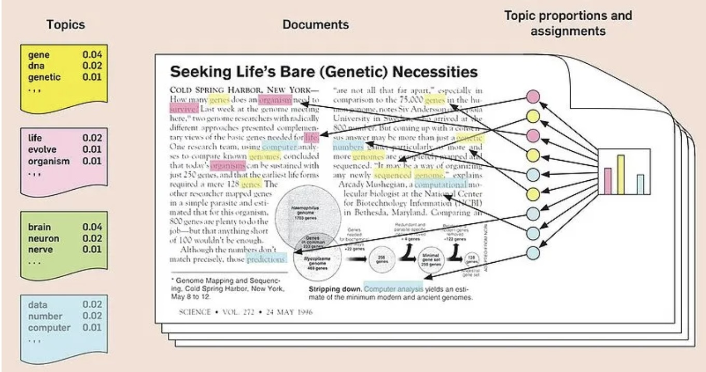

## Recap: DFM & tf-idf

- Corpus → tokens → DFM → tf-idf weighting
- Rows = docs, columns = terms, cells = (weighted) frequency

# Unsupervised Learning: Topic Modeling

## Supervised vs. unsupervised learning

- **Supervised**: labeled data, learn a mapping inputs → outputs
  (classification, regression)
- **Unsupervised**: no labels, discover structure (clustering,
  dimensionality reduction)
- Same distinction applies to text, images, or numeric data

## What is Topic Modeling?

- LDA: documents are *mixtures* of topics; topics are distributions
  over words
- Generative story: pick a topic mix for the doc → pick a topic per
  word → pick a word from that topic



## Key concepts

- **Topics** — clusters of words that co-occur
- **Topic distribution** — mix of topics per document (theta)
- **Word distribution** — representative words per topic
- Must choose **k** (number of topics) — usually trial and error

## Discussion: what can go wrong?

- No universal way to pick k, yet k drives the results
- Uniform topic distribution assumption often fails → topic infusion
- Human sense-making bias: we're *too* good at finding patterns

## Fitting an LDA model

```{r}
#| echo: true
library(quanteda.textmodels); library(seededlda)

set.seed(123)
lda_fit <- seededlda::textmodel_lda(dfm_tfidf_mat, k = 5, alpha = 0.7)

terms(lda_fit, 10)          # top terms per topic
theta <- lda_fit$theta      # topic proportions per document
```

## Task: Female and Male Topic Models {.smaller}

- Fit LDA separately for female and male corpora, k = 6
- Example labels — Female: Research/Science, Literature,
  Chemistry/Medicine, Human rights/Peace, First awards
- Example labels — Male: Research/Science/Medicine, Chemistry,
  Physics, Literature, Politics, Economy

# Supervised Learning

## From unsupervised to supervised

- Target feature: `gender` (female/male)
- Predictor: the biography text
- Split into **train** (80%) / **test** (20%) sets
- Watch for class imbalance when splitting

## Dictionaries

- Predefined word lists mapped to categories (e.g. pronouns → gender)
- Classify by counting dictionary-word occurrences per document

```{r}
#| echo: true
dict_gender <- dictionary(list(
  female = c("she","her","hers","herself"),
  male   = c("he","him","his","himself")
))
dfm_pron <- dfm_lookup(dfm_all, dict_gender)
```

## Naive Bayes Classification

- Probabilistic classifier based on Bayes' Theorem
- "Naive": assumes features are conditionally independent given the
  class
- Widely used for high-dimensional data like text

```{r}
#| echo: true
nb_train <- textmodel_nb(x = dfm_train, y = y, prior = "docfreq")
predict(nb_train, newdata = dfm_test, type = "class")
```

## Model evaluation

$$Accuracy = \frac{\text{Correct}}{\text{Total}} \quad
Precision = \frac{TP}{FP+TP} \quad
Recall = \frac{TP}{FN+TP}$$

$$F_1 = 2 \times \frac{Precision \times Recall}{Precision + Recall}$$

- Class imbalance → the model may just always predict the majority
  class

## Task {.smaller}

- Why do we track precision/recall separately instead of just
  accuracy?
- Why might the true negative rate be zero on an imbalanced set?
- Bonus: build a STEM vs. non-STEM prize classifier
