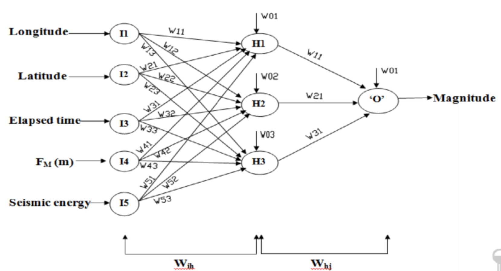

## Recap: DFM & tf-idf

- Corpus → tokens → DFM → tf-idf weighting
- Rows = docs, columns = terms, cells = (weighted) frequency

# Supervised Learning

## Supervised vs. unsupervised learning

- **Supervised**: labeled data, learn a mapping inputs → outputs
  (classification, regression) — our focus today
- **Unsupervised**: no labels, discover structure (clustering, topic
  modeling) — see the [Day 1 notes](../notes/day1.qmd) if you want to
  explore this on your own
- Target feature: `gender` (female/male); predictor: the biography text
- Split into **train** (80%) / **test** (20%) sets — watch for class
  imbalance when splitting

## Dictionaries

- Predefined word lists mapped to categories (e.g. pronouns → gender)
- Classify by counting dictionary-word occurrences per document

```{r}
#| echo: true
dict_gender <- dictionary(list(
  female = c("she","her","hers","herself"),
  male   = c("he","him","his","himself")
))
dfm_pron <- dfm_lookup(dfm_all, dict_gender)
```

## Naive Bayes Classification

- Probabilistic classifier based on Bayes' Theorem
- "Naive": assumes features are conditionally independent given the
  class
- Widely used for high-dimensional data like text

```{r}
#| echo: true
nb_train <- textmodel_nb(x = dfm_train, y = y, prior = "docfreq")
predict(nb_train, newdata = dfm_test, type = "class")
```

## Model evaluation

$$Accuracy = \frac{\text{Correct}}{\text{Total}} \quad
Precision = \frac{TP}{FP+TP} \quad
Recall = \frac{TP}{FN+TP}$$

$$F_1 = 2 \times \frac{Precision \times Recall}{Precision + Recall}$$

- Class imbalance → the model may just always predict the majority
  class

## Task {.smaller}

- Why do we track precision/recall separately instead of just
  accuracy?
- Why might the true negative rate be zero on an imbalanced set?
- Bonus: build a STEM vs. non-STEM prize classifier

# Word Embeddings

## What are word embeddings?

- "You shall know a word by the company it keeps" (Firth, 1957)
- Represent each word as a dense vector; similar meaning → nearby
  vectors
- Pre-trained on huge corpora: Word2Vec, GloVe, fastText
- **Window size** = how many words of context count around a target
  word

## How are they trained?

- Model predicts a masked word from context ("the ___ chased the ball")
- Compares its guess to the real word, updates weights via gradient
  descent
- Words that co-occur often end up with nearby vectors

## Loading embeddings & nearest neighbors

```{r}
#| echo: true
library(data.table)
emb <- fread("path/to/embeddings.txt", header = FALSE, quote = "")
words <- emb[[1]]
glove <- as.matrix(emb[, -1, with = FALSE])
rownames(glove) <- words

glove["dog", ]   # look up a word's vector
```

```{r}
#| echo: true
library(text2vec)
sims <- sim2(glove, matrix(glove["woman", ], nrow = 1))
names(sort(sims[, 1], decreasing = TRUE))[1:7]
```

## Visualization

- Reduce embedding dimensions (PCA) down to 2 for plotting
- Closer points ≈ closer meaning

```{r}
#| echo: true
Z <- prcomp(glove[c("einstein","curie","nobel","peace"), ])$x[, 1:2]
```

# Large Language Models

## What are Large Language Models?

- Deep learning models trained on vast text corpora to model language
- **Foundation models** → pre-trained, general-purpose
- **LLMs** → foundation models specialized for language tasks
- **Fine-tuning** vs. **prompting** (zero-shot / few-shot)
- Prefer prompting first — fine-tuning is costly and data-hungry

## Why are LLMs so powerful?

- All LLMs are transformer models
- **Attention** — weighs the importance of each word when predicting
  the next one
- Captures long-range dependencies better than RNNs/LSTMs

## Feedforward neural networks

- Information flows one direction: input → hidden layer(s) → output
- No cycles; every node connects to every node in the next layer,
  each connection weighted



## Transformer Models

- Stack of encoders + decoders
- Encoder: self-attention + feedforward layers → rich input
  representation
- Decoder: generates output using that representation, also via
  self-attention
- Trained via next-word prediction & masked-word prediction


## Running local LLMs with Ollama

- [Ollama](https://ollama.com/) runs open LLMs (e.g. Llama) locally
- No cloud dependency, full control over the model

```{r}
#| echo: true
library(rollama)
list_models()
ping_ollama()
```

## System vs. user prompts

- **System prompt** — assigns a role & constraints ("You are a
  research assistant…")
- **User prompt** — the task-specific instruction + content

```{r}
#| echo: true
question <- "Task: classify whether this biography summary
  describes a female or male Nobel laureate."
query(paste(question, df$extract[1]), model = "llama3.1")
```

## Task {.smaller}

- Zero-shot classify a handful of biography summaries by gender using
  `rollama`
- Compare the LLM's predictions to the Naive Bayes classifier from
  earlier today — where do they agree/disagree, and why?
